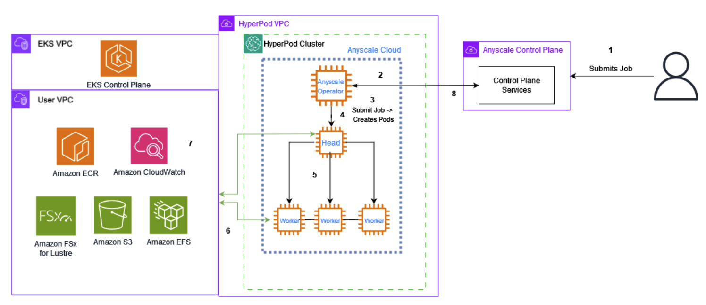

# Anyscale

[Anyscale](https://www.anyscale.com/)'s Ray ecosystem can build upon this solid foundation with advanced distributed computing capabilities. [RayTurbo](https://www.anyscale.com/product/platform/rayturbo) features optimize computational performance across the cluster, while a unified control plane simplifies management of complex distributed systems. The platform excels at dynamic container scalability, intelligent workload distribution and efficient task allocation across the cluster. Optimized multi-GPU communication patterns ensure efficient data transfer, creating a seamless distributed computing environment perfectly suited for demanding ML workloads. Anyscale aims to remove the complexity of building and managing distributed infrastructure, allowing developers to focus on building AI/ML applications.





1. Review the `env_vars` file. You can leave the values as default or make desired changes.

2. Deploy requirements
```
chmod +x 1.deploy-requirements.sh
./1.deploy-requirements.sh
```

3. Create [Elastic File System](https://aws.amazon.com/efs/) (EFS)
```
chmod +x 2.create-efs.sh
./2.create-efs.sh
```

4. Register Anyscale Cloud
```
chmod +x 3.register-cloud.sh
./3.register-cloud.sh
```

5. Deploy Kubernetes Anyscale Operator
```
chmod +x 4.deploy-anyscale.sh
./4.deploy-anyscale.sh
```


Please see { Blog Out Soon } for more details!


