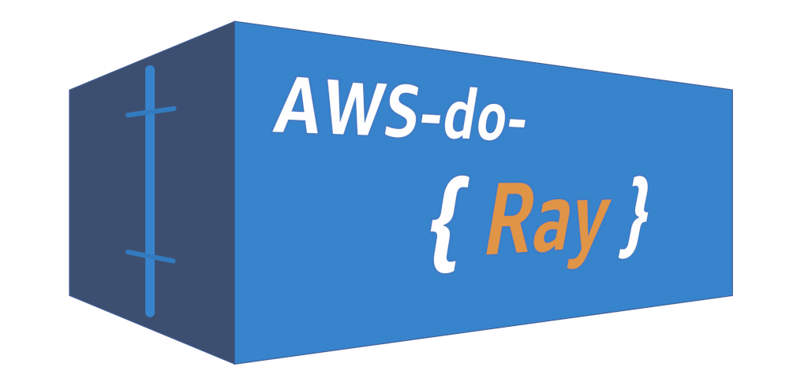
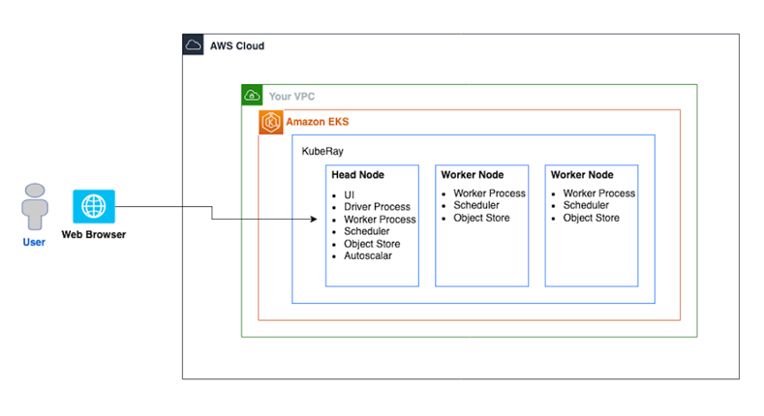
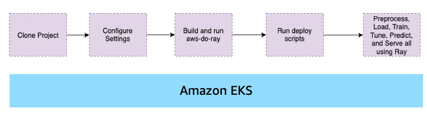
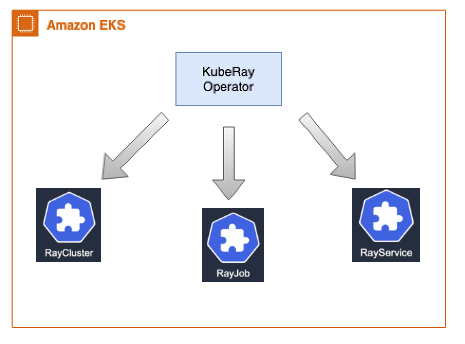
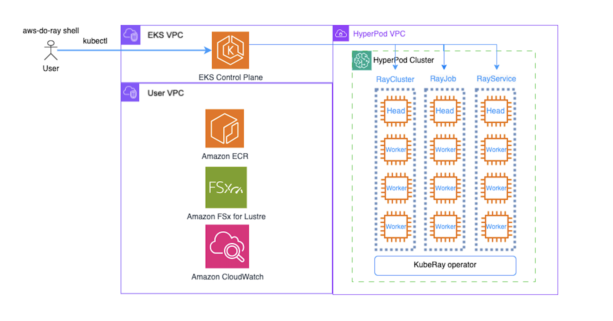
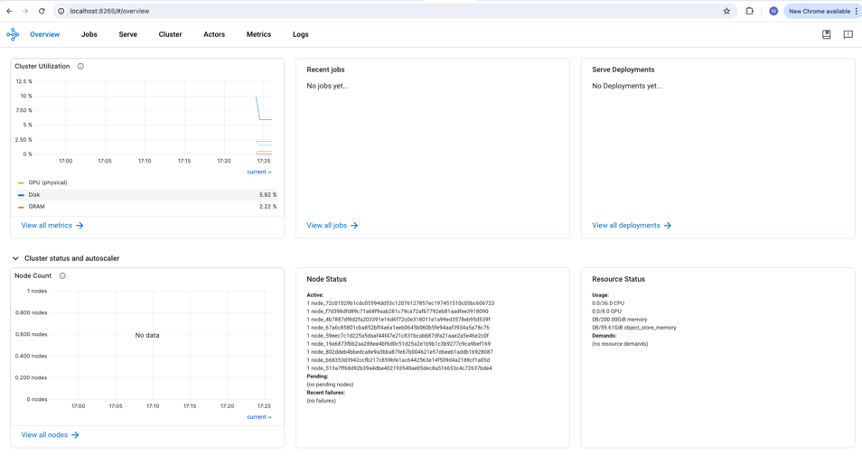
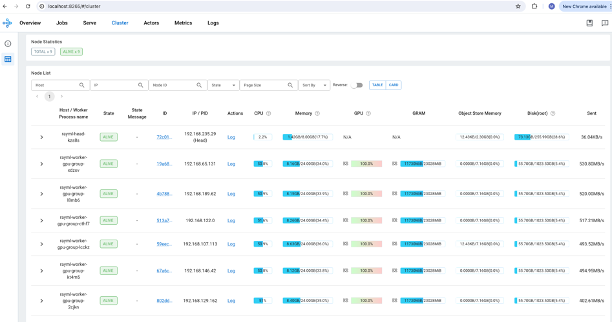
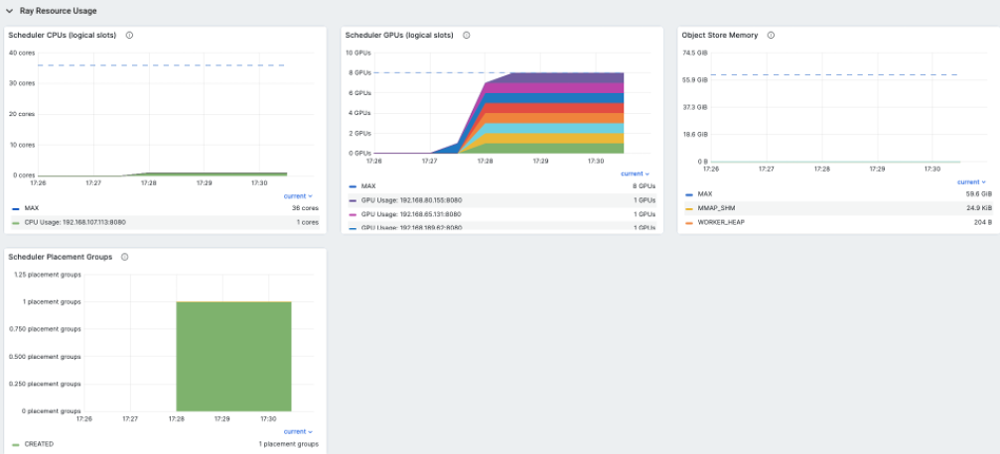

# AWS do Ray (aws-do-ray) <br/> Create and manage your Ray clusters on Amazon EKS using the [do-framework](https://bit.ly/do-framework)

<center>


Fig. 1 - Ray on EKS cluster sample
</center>
<br/>
<br/>


## Overview
The [`aws-do-ray`](https://bit.ly/aws-do-ray) project aims to simplify the deployment and scaling of distributed Python application using [Ray](https://www.ray.io/) on [Amazon Elastic Kubernetes Service](https://docs.aws.amazon.com/whitepapers/latest/overview-deployment-options/amazon-elastic-kubernetes-service.html) (Amazon EKS) or [Amazon SageMaker Hyperpod](https://aws.amazon.com/sagemaker/hyperpod/). While following the principles of the [do-framework](https://bit.ly/do-framework) and using the [Depend on Docker](https://github.com/iankoulski/depend-on-docker) template, it uses [Docker](https://docs.docker.com/get-docker/) to containerize all tools necessary to deploy and manage Ray clusters, jobs, and services. The `aws-do-ray` container shell is equipped with intuitive action scripts and comes pre-configured with convenient shortcuts which save extensive typing and increase productivity. This project provides a streamlined solution for administrators and developers, enabling them to focus on the task at hand, rather than infrastructure management. In summary, `aws-do-ray` is a simple, flexible, and universal DevOps solution for Ray workloads on AWS. 

## Prerequisites
The only prerequisites needed to run this project are:

* [AWS Account](https://signin.aws.amazon.com/signup?request_type=register)
* [EKS](https://bit.ly/do-eks) or [HyperPod](https://bit.ly/aws-do-hyperpod) cluster
* [Docker](https://docs.docker.com/get-docker/)

## Usage
 A typical workflow for the `aws-do-ray` project is described below.

<center>


Fig.2 - Typical workflow for the aws-do-ray project
</center>
<br/>
<br/>

To use the project, you can clone and configure it, then run the `./build.sh`, `./run.sh`, and `./exec.sh` scripts to open the `aws-do-ray` shell. Execute the `./setup-dependencies.sh` script, then from the raycluster directory execute `./raycluster-config.sh` and `./raycluster-create.sh`. Once the cluster is created, examples can be executed from the [jobs](https://github.com/aws-samples/aws-do-ray/tree/main/Container-Root/ray/raycluster/jobs) folder, submit one of the jobs using `./job-submit.sh <job-folder-name>

```bash
# Build and run container
git clone https://github.com/aws-samples/aws-do-ray
cd aws-do-ray
./config.sh
./build.sh
./run.sh
./exec.sh

# Create Ray cluster
./setup-dependencies.sh
cd raycluster
./raycluster-config.sh
./raycluster-create.sh
./raycluster-status.sh

# Run job
cd jobs
./job-submit.sh quickstart
./job-list.sh
```

## Configure

To configure your aws client, execute `aws configure` within the container shell, or outside the container, if you have aws CLI v2.x installed.

If you are not connected to an EKS cluster yet, follow the instructions [here](https://docs.aws.amazon.com/eks/latest/userguide/create-kubeconfig.html) to generate a `~/.kube/config` file. The project will automatically use the current kubernetes conext to retrieve the name of the EKS cluster it should connect to. Your current EKS cluser context can be displayed by using the following command: `kubectl config current-context`.

All configuration settings of the `aws-do-ray` project are centralized in its [`.env`](.env)) file. To review or change any of the settings, simply execute [`./config.sh`](./config.sh)).
The project automatically sets all variables, but you can manually override any of them by setting your preferred value in the `.env` file.

* AWS_REGION should match the AWS Region where the cluster is deployed.
* The AWS_EKS_CLUSTER setting should match the name of your existing EKS Cluster. 
* AWS_EKS_HYPERPOD_CLUSTER setting should match the name of your existing EKS Hyperpod Cluster
* CLUSTER_TYPE setting must either be "eks" or "hyperpod" depending on what type of cluster you are using.

To configure credentials of your aws client, run `aws configure`. Credentials you configure either on the host or in the containr will be mounted into the `aws-do-eks` container according to the `VOL_MAP` setting in [`.env`](.env). If you set the following environment variables `AWS_REGION`, `AWS_ACCESS_KEY_ID`, `AWS_SECRET_ACCESS_KEY`, and `AWS_SESSION_TOKEN`, they will be carried over into the `aws-do-ray` container when the `./run.sh` script is executed. 

## Build
This project follows the [Depend on Docker](https://github.com/iankoulski/depend-on-docker) template to build a container including all needed tools and utilities for creation and management of Ray. Please execute the [`./build.sh`](./build.sh) script to create the `aws-do-ray` container image and tag it using the registry and version tag specified in the project configuration. If desired, the image name or registry address can be modified in the project configuration file [`.env`](.env).
A pre-built `aws-do-ray` container is available on the [AWS public registry](https://gallery.ecr.aws/hpc-cloud/) 

## Run
The [`./run.sh`](./run.sh) script starts the project container. 
If you would like to run the pre-built `aws-do-ray` container, you can configure the project with `REGISTRY=public.ecr.aws/hpc-cloud/aws-do-ray`, prior to executing `./run.sh` or just execute the following command:

```bash
docker run --rm -it -v ${HOME}/.aws:/root/aws -v ${HOME}/.kube:/root/.kube --workdir /ray public.ecr.aws/hpc-cloud/aws-do-ray bash
```

## Status
To check the status of the container, execute [`./status.sh`](./status.sh). If the container is in the Exited state, it can be started with [`./start.sh`](./start.sh).

## Exec
After the container is started, use the [`./exec.sh`](./exec.sh) script to open a bash shell in the container. All necessary tools to allow creation, management, and operation of Ray are available in this shell. 

## Deploy KubeRay operator
Once you have opened the `aws-do-ray` shell you will be dropped in the [`/ray`](/Container-Root/ray/) directory where you will find the [`./setup-dependencies.sh`](/Container-Root/ray/setup-dependencies.sh) script. This deployment creates a `kuberay` namespace and a `kuberay-operator` pod in the kuberay namespace. It will then dynamically provision an FSx for Lustre volume for a shared file system in your Ray cluster. Upon successful deployment, you will have the kuberay operator pod running in the kuberay namespace, and a bound persistent volume claim (PVC) in your current namespace. To check the state of the kuberay-operator pod, use command: `kubectl -n kuberay get pods`, and to check the state of your PVC, please run `kubectl get pvc`.

### The KubeRay operator
>[!IMPORTANT]
>Please note that we advise to use `kuberay-operator` version $\geq$ 1.2.0. In this version the `raycluster_controller` was updated to support automatic eviction of Ray Pods in case of a pod failure (e.g. due to HW failure of the underlying EKS or HyperPod Node). In this case KubeRay will delete the Pod and create new Pods in the next reconciliation if necessary. This is particularly important and useful when deploying your RayCluster onto a SageMaker HyperPod cluster.

The KubeRay Operator gets deployed on the EKS cluster through the `./setup-dependencies.sh` script. KubeRay creates the following Custom Resource Definitions (CRDs): RayCluster, RayService, and RayJobs.

1. RayCluster: primary resource for managing Ray instances on Kubernetes. It represents a cluster of Ray nodes, including a head node and multiple worker nodes. The RayCluster CRD determines how the Ray nodes are set up, how they communicate, and how resources are allocated among them. The nodes in a Ray cluster manifest as pods in the EKS cluster.

3. RayJob: represents a single executable job that runs on a RayCluster. It is a higher-level abstraction used to submit tasks or batches of tasks that should be executed by the RayCluster.

5. RayService: Kubernetes resource that enables long-running Ray applications. It allows for the deployment of Ray applications that need to be exposed for external communication, typically through a service endpoint.

<center>


Fig.2 - Types of Ray custom resources in Kubernetes
</center>
<br/>
<br/>

The KubeRay operator relies on the Kubernetes API and works on EKS as well as HyperPod clusters with EKS support. 
A diagram showing deployment of Ray on SageMaker HyperPod is shown below.

<center>


Fig.3 - KubeRay operator deployment on SageMaker HyperPod EKS cluster
</center>
<br/>
<br/>

## Distributed training jobs
Additional information about your distributed training jobs.
1. From [Ray Documentation](https://docs.ray.io/en/latest/train/getting-started-pytorch.html), specifying a shared storage location (such as cloud storage or NFS) is optional for single-node clusters, but it is required for multi-node clusters. Using a local path will raise an error during checkpointing for multi-node clusters. This is why the [`./setup-dependencies.sh`](/Container-Root/ray/setup-dependencies.sh) script creates an FSx for Lustre volume. For other deployments, like S3 Mount point, please refer to the [`Deploy Scripts`](#deploy-scripts) section of this document. Once you have a shared storage path, use `storage_path` in the `RunConfig` of your Python training scripts to save checkpoints, logs, and model artifacts. By default, it points to your new FSx for Lustre mount.

2. Within the python code provided, you can also set num_workers to an int (the number of ray workers you are using) and use_gpu to a boolean (True or False, default is set to True). Default is num_workers=2 and use_gpu=True. 


## Create a RayCluster
Within the [`/ray`](/Container-Root/ray/) directory, you will find the [`/raycluster`](/Container-Root/ray/raycluster/) directory. This directory contains the following scripts:
- [`./raycluster-create.sh`](/Container-Root/ray/raycluster/raycluster-create.sh) : this script creates the ray cluster specified in the [`raycluster-template.yaml`](/Container-Root/ray/raycluster/raycluster-template.yaml) file. 
- [`./raycluster-delete.sh`](/Container-Root/ray/raycluster/delete-cluster.sh) : this script deletes the ray cluster specified in the [`raycluster-template.yaml`](/Container-Root/ray/raycluster/raycluster-template.yaml) file. 
- [`./raycluster-pods.sh`](/Container-Root/ray/raycluster/raycluster-pods.sh) : this script allows you to see your currently running pods(or nodes) of your raycluster.
- [`./raycluster-status.sh`](/Container-Root/ray/raycluster/raycluster-status.sh) : this script retrieves the status of your current raycluster. 
- You can run [`re`] to expose ray cluster to port :8265, and [`rh`] to hide it. This is also done automatically when needed by other scripts.
- [`./raycluster-config.sh`](/Container-Root/ray/raycluster/raycluster-config.sh) : run this to edit the [`raycluster-template.yaml`](/Container-Root/ray/raycluster/raycluster-template.yaml), or simply open the [`raycluster-template.yaml`](/Container-Root/ray/raycluster/raycluster-template.yaml) in your favorite editor.
- [`raycluster-template.yaml`](/Container-Root/ray/RayCluster/raycluster-template.yaml) : a default ray cluster configuration with every option you can have in a ray cluster. "Batteries included but swappable". 
- [`raycluster-template-autoscaler.yaml`](/Container-Root/ray/raycluster/raycluster-template-autoscaler.yaml) : the same ray cluster configuration but with the ray autoscaler enabled.
- [`./jobs/job-submit.sh <job>`](/Container-Root/ray/raycluster/jobs/job-submit.sh) : this script allows you to submit a Python Script for a job. You can put your code within the [`/jobs`](/Container-Root/ray/raycluster/jobs/) section of the repo with a directory named after the script you want to execute, with that script within that directory. Or you can submit it via file system that has your script that is attached to your ray pods. 
	- If your script is in the [`/jobs`](/Container-Root/ray/raycluster/jobs/) folder, it will submit the ray job via the ray job submission SDK (dashboard must be exposed via [`re`](/Container-Root/ray/ops/ray-expose.sh)) or it will submit directly through the head pod. Just run `./job-submit.sh <script name>`. Ex/ `./job-submit.sh dt-pytorch`.
	- If your script is in a file system that is attached to your ray pods, it you must specify the directory that the script is in relative to your head pod. Run `./job-submit.sh <script name> <directory>`. Ex/ `./job-submit.sh dt-pytorch fsx/code/dt-pytorch` where my dt-pytorch.py file is located in directory fsx/code/dt-pytorch. 

### RayCluster template
For everything you need to know about the details of a RayCluster configuration, please refer to the comments in the template, as well as this [doc](https://docs.ray.io/en/latest/cluster/kubernetes/user-guides/config.html). But as a quick reference, here are the main concepts in the template:
* metadata: name: 
    * This is where you can name your raycluster.
* nodeSelector in both headGroupSpec and workerGroupSpecs:
    * This is where you can specify which nodes your head pod and worker pods get assigned to. Preferably assign the worker group pods to the nodes with GPU's. 
* replicas
    * This defines how many min, max, and desired worker pods are in your RayCluster. 
* containers: resources: limits/requests:
    * These fields are under both headGroupSpec and workerGroupSpecs and these values set resource limits and requests for your pods. Please confirm your node resource capabilities before setting these values.
* containers: image: 
    * This is the container image each pod runs. It is best practice that the head pod and worker pods use the same container image, ex/ "rayproject/ray-ml:latest"
* containers: env: name: (AWS KEYS)
    * After deploying your kubectl secrets by running [`./deploy/kubectl-secrets/kubectl-secret-keys.sh`](./Container-Root/ray/deploy/kubectl-secrets/kubectl-secret-keys.sh) your Ray pods will now have IAM permissions to access other buckets/filesystems/etc. If this is needed, please uncomment this section out in the template. 
* volumeMounts and volumes under headGroupSpec and workerGroupSpecs
    * This is where you can mount volumes like S3, EFS, FSx for Lustre on to your pods.
This is needed for multi node distributed training jobs.

### Ray dashboard
In order to access the Ray Dashboard, the Istio Ingress Gateway service of the Ray deployment needs to be exposed outside the cluster. In a production deployment typically an Application Load Balancer (ALB) is used, however this requires a DNS domain registration and a matching SSL certificate.

For an easy way to expose the Ray Dashboard, we can use kubectl port-forward. To start the port-forward, simply execute `ray-expose.sh` or `re`. To stop the port-forward, simply execute `ray-hide.sh` or `rh`.

If you are on a machine with its own browser, just navigate to http://localhost:8265 to open the Ray Dashboard.

<center>


Fig.4 - Ray Dashboard Overview
</center> 
<br/>
<br/>

<center>


Fig.5 - Ray Dashboard Jobs
</center> 
<br/>
<br/>

<center>


Fig.6 - Ray Dashboard Metrics
</center>
<br/>
<br/>

## Create a RayJob
Within the [`/ray`](/Container-Root/ray/) directory, you will find the [`/rayjob`](/Container-Root/ray/rayjob/) directory. Within this directory, you will find these scripts:
- [`./rayjob-create.sh <Job>`](/Container-Root/ray/rayjob/rayjob-create.sh) : this script creates the rayjob. This consists of a RayJob and a RayCluster. The RayJob manages the RayCluster. 
- [`./rayjob-delete.sh`](/Container-Root/ray/rayjob/rayjob-delete.sh) : this script deletes the rayjob speficied in the [`rayjob-template.yaml`](/Container-Root/ray/RayJob/rayjob-template.yaml)
- [`./rayjob-logs.sh](/Container-Root/ray/rayjob/rayjob-logs.sh) : this script allows you to see the logs of your rayjob.
- [`./rayjob-pods.sh`](/Container-Root/ray/rayjob/rayjob-pods.sh) : this script allows you to see your currently running pods of your rayjob.
- [`./rayjob-status.sh`](/Container-Root/ray/rayjob/rayjob-status.sh) : this script retrieves the status of your current rayjob. 
- [`rayjob-template.yaml`](/Container-Root/ray/rayjob/rayjob-template.yaml): a default rayjob configuration with every option you can have in a rayjob. "Batteries included but swappable and/or removable". the ray cluster aspect of it is the same as [`raycluster-template.yaml`](/Container-Root/ray/raycluster/raycluster-template.yaml).
- Please run [`re`] to expose ray cluster to port :8265, and [`rh`] to stop expose. 


### RayJob documentation
You can find RayJob Documentation [here](https://docs.ray.io/en/latest/cluster/kubernetes/getting-started/rayjob-quick-start.html)


## Create a RayService
Within the [`/ray`](/Container-Root/ray/) directory, you will find the [`/rayservice`](/Container-Root/ray/rayservice/) directory, which contains the following scripts:
- [`./rayservice-create.sh <model>`](/Container-Root/ray/rayservice/rayservice-create.sh) : this script creates a rayservice cluster and exposes the service port for querying your served model.
- [`./rayservice-test.sh <model>`](/Container-Root/ray/rayservice/rayservice-test.sh) : this script sends the query specificed in the [`<model>/<model>_req.py] file to your rayservice cluster. Feel free to edit the query before running this script. 
- [`./rayjob-delete.sh <model>`](/Container-Root/ray/rayservice/rayservice-delete.sh) : this script deletes the rayservice speficied.
- [`./rayservice-status.sh](/Container-Root/ray/rayservice/rayservice-status.sh) : this script allows you to see the status of your rayservice cluster.

### Ray Serve QuickStart
RayServe Quickstart on Kubernetes can be found [here](https://docs.ray.io/en/latest/serve/production-guide/kubernetes.html)

### Serve Config V2 Section of RayServe Template
This section defines the configuration for Ray Serve applications. More details [here](https://docs.ray.io/en/latest/serve/production-guide/config.html). 

**applications**: A list of applications to be deployed.
- **name**: The name of the application, in this case, `image_classifier`.
- **import_path**: The import path for the application's module, `serve-train-images.app`.
- **route_prefix**: The route prefix for accessing the application, `/classify`.
- **runtime_env**: Specifies the runtime environment for the application.
    - **working_dir**: The working directory for the application, specified as an S3 path.
    - **pip**: A list of Python packages to be installed in the runtime environment.
- **deployments**: A list of deployments for the application.
    - **name**: The name of the deployment, `ImageClassificationModel`.
    - **num_replicas**: The number of replicas for the deployment, set to `1`.
    - **ray_actor_options**: Options for the Ray actors.
        - **num_cpus**: The number of CPUs allocated for each actor, set to `1`.


## Deploy scripts

### Prometheus & Grafana
The `aws-do-ray` project provides an example setup to monitor Ray clusters in Kubernetes using Prometheus & Grafana.

Action scripts are located in the [`/ray/deploy/prometheus`](/Container-Root/ray/deploy/prometheus/) folder. 

- [`./deploy-prometheus.sh`](/Container-Root/ray/deploy/prometheus/deploy-prometheus.sh) : deploys all prometheus/grafana pods in order to scrape your Ray pod metrics
- [`./expose-prometheus.sh`](/Container-Root/ray/deploy/prometheus/expose.sh) port forwards the prometheus/grafana dashbaord so you can open the UI locally
In order to see data on your Ray dashboard, please follow these steps:
	- Sign in with username: `admin`, password: `prom-operator`
	- Import Grafana dashboard file ‘dashboard_default.json’. Click “dashboards” → “new” → import → “upload json” from [`ray/deploy/prometheus/kuberay/config/grafana/default_grafana_dashboard.json`](/Container-Root/ray/deploy/prometheus/kuberay/config/grafana/default_grafana_dashboard.json)
	- After reloading the page in your browser, you should be able to see the Grafana metrics on the Ray dashboard

<center></center> <br/>
<center>Fig.6 - Ray Dashboard Prometheus & Grafana Metrics</center> <br/>

### Kubectl secrets
The [`/ray/deploy/kubectl-secrets`](/Container-Root/ray/deploy/kubectl-secrets/) folder contains the following script:

[`./kubectl-secret-keys.sh`](/Container-Root/ray/deploy/kubectl-secrets/kubectl-secret-keys.sh) : creates a kubectl secret for cases when python code needs access to your AWS credentials. 

### S3 Mountpoint
The [`/ray/deploy/s3-mountpoint`](/Container-Root/ray/deploy/s3-mountpoint/) folder contains the following scripts:

[`./deploy.sh`](/Container-Root/ray/deploy/s3-mountpoint/deploy.sh): creates an IAM OIDC identity provider for your cluster, creates an IAM policy, creates an IAM role, and installs the mountpoint for Amazon S3 CSI driver. **Please ensure you have either exported `S3_BUCKET_NAME` as an environment variable, or manually replaced `$S3_BUCKET_NAME` in the [`./deploy.sh`](/Container-Root/ray/deploy/s3-mountpoint/deploy.sh) script.**

[`./s3-create.sh`](/Container-Root/ray/deploy/s3-mountpoint/s3-create.sh): creates a PV and a PVC which you can then use to mount to your ray pods within the "volumes" section in your raycluster template. 


### FSx for Lustre
Related scripts are found in the [`/ray/deploy/fsx`](/Container-Root/ray/deploy/fsx/) folder. 

Please ensure your "AWS_EKS_CLUSTER" and "AWS_REGION" are set in your .env file. If not, you can manually set these variables within the deploy.sh code. 

[`./deploy.sh`](/Container-Root/ray/deploy/fsx/deploy.sh): creates an IAM OIDC identity provider for your cluster, deploys FSx for Lustre CSI driver, and creates an IAM role bound to the service account used by the driver. 

The [Amazon FSx for Lustre CSI driver](https://github.com/kubernetes-sigs/aws-fsx-csi-driver) presents you with two options for provisioning a file system. 

_Dynamic provisioning_: This option leverages Persistent Volume Claims (PVCs) in Kubernetes. You define a PVC with desired storage specifications. The CSI Driver automatically provisions the FSx file system for you based on the PVC request. This allows for easier scaling and eliminates the need to manually create file systems.

_Static provisioning_: In this method, you manually create the FSx file system before using the CSI Driver. You'll need to configure details like subnet ID and security groups for the file system. Then, you can use the Driver to bing the PV to a PVC and mount this pre-created file system within your container as a volume.

#### Dynamic Provisioning

The [`setup-dependencies.sh`](/Container-Root/ray/setup-dependencies.sh) script creates a dynamic FSxL volume, but this can also be done independently.

If you would like to use dynamic provisioning, ensure you have your desired configuration in [`dynamic-storageclass.yaml`](/Container-Root/ray/deploy/fsx/dynamic-storageclass.yaml) as well as inputting your "subnetID" and your "securityGroupIds". 

These variables are retrieved once the container is built and set as environment variables... but if you'd like them to be altered, you can change $SUBNET_ID and $SECURITYGROUP_ID in [`dynamic-storageclass.yaml`](/Container-Root/ray/deploy/fsx/dynamic-storageclass.yaml)

* subnetId - The subnet ID that the FSx for Lustre filesystem should be created inside. Using the $SUBNET_ID environment variable, we are referencing the same private subnet that was used for EKS or EKS HyperPod cluster creation.

* securityGroupIds - A list of security group IDs that should be attached to the filesystem. Using the $SECURITY_GROUP environment variable, we are referencing the same security group that was use for EKS or EKS HyperPod cluster creation.

Once the storage class has been configured, you can run [`./dynamic-create.sh`](/Container-Root/ray/deploy/fsx/dynamic-create.sh) to create an FSxL volume.


#### Static Provisioning

If you would like to use static provisioning, ensure you your volumeHandle: is set with your FSx file system ID, dnsname: is set with your FSx file system DNS name, and your mountname: is set with your FSx file system mount name in ['static-pv.yaml'](/Container-Root/ray/deploy/fsx/static-pv.yaml). Also ensure that your fileSystemId: is set with your FSx file system ID, subnetId: is set with your subnet ID, and your securityGroupIds: are set with your security group ID(s) within [`static-storageclass.yaml`](/Container-Root/ray/deploy/fsx/static-storageclass.yaml). 

Running [`./static-create.sh`](/Container-Root/ray/deploy/fsx/static-create.sh) creates a PV and a PVC which you can then use to mount to your Ray pods within the "volumes" section in your raycluster template. 

## Container command reference
The project home folder offers a number of additional scripts for management of the aws-do-ray container.
- [`./config.sh`](./config.sh) – configure aws-do-ray project settings interactively
- [`./build.sh`](./build.sh) – build aws-do-ray container image
- [`./push.sh`](./push.sh) – push aws-do-ray container image to configured registry
- [`./pull.sh`](./pull.sh) – pull aws-do-ray container image from a configured existing registry
- [`./run.sh`](./run.sh) – run aws-do-ray container
- [`./status.sh`](./status.sh) – show logs of the running aws-do-ray container
- [`./logs.sh`](./logs.sh) – show logs of the running aws-do-ray container
- [`./start.sh`](./start.sh) – start the aws-do-ray container if it is currently in “Exited” status
- [`./exec.sh`](./exec.sh) – execute a command inside the running aws-do-ray container, the default command is bash
- [`./stop.sh`](./stop.sh) – stop and remove the aws-do-ray container
- [`./test.sh`](./test.sh) – run container unit tests


## Troubleshooting
* Worker pods can't be scheduled to worker nodes
	* This can be due to taints present on your nodes or tolerations missing from your pods. Make sure worker node group contains the taints that are specified as tolerations in the ray cluster yaml. Alternatively, you can take out the taints and tolerations all together. 

* Error: You must be logged in to the server (Unauthorized)
    * Ensure you are connected to the right AWS account, please run `aws sts get-caller-identity` in the terminal to verify your current identity
    * Ensure you are connected to the right EKS cluster and region, please run `kubectl config current-context` to check the current context and `aws eks update-kubeconfig --region <region-code> --name <my-cluster>` to change the current context if needed.

* EKS API Serve Unauthorized Error (trouble accessing ray cluster from another EC2 instance)
    * [`Create access entry in EKS`](https://repost.aws/knowledge-center/eks-api-server-unauthorized-error)

* [`An error occurred (InvalidClientTokenId) when calling the GetCallerIdentity operation: The security token included in the request is invalid`]
    * You may need to run [`unset AWS_PROFILE`] to rely on the AWS credentials provided through the environment variables rather than the default profile in ~/.aws/credentials or ~/.aws/config.
    * You man need to delete ACCESS_TOKEN from your ~/.aws/credentials file if your token has expired


## Security

See [CONTRIBUTING](CONTRIBUTING.md#security-issue-notifications) for more information.

## License

This project is licensed under the MIT-0 License. See the [LICENSE](LICENSE) file.

## Disclaimer

This sample code should not be used in production accounts, on production workloads, or on production or other critical data. You are responsible for testing, securing, and optimizing the sample code as appropriate for production-grade use based on your specific quality control practice and standards.

## References

* [Docker](https://docker.com)
* [Kubernetes](https://kubernetes.io)
* [Amazon Web Services (AWS)](https://aws.amazon.com/)
* [Amazon EC2 instance types](https://aws.amazon.com/ec2/instance-types/)
* [Amazon Elastic Kubernetes Service (EKS)](https://aws.amazon.com/eks)
* [do-framework](https://bit.ly/do-framework)
* [Depend on Docker](https://github.com/iankoulski/depend-on-docker)
* [Ray documentation](https://docs.ray.io/en/latest/ray-overview/index.html)
* [Ray project](https://github.com/ray-project)
* [Ray on EKS](https://awslabs.github.io/data-on-eks/docs/blueprints/ai-ml/ray)
* [SageMaker HyperPod](https://aws.amazon.com/sagemaker/hyperpod/)
* [aws-do-hyperpod](https://bit.ly/aws-do-hyperpod)

## Credits
* Mark Vinciguerra - @mvincig
* Alex Iankoulski - @iankouls
* Florian Stahl - @flostahl
* Milena Boytchef - @boytchef
