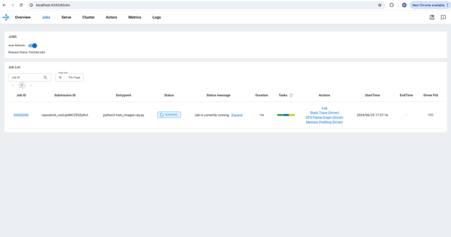

# AWS do Ray (aws-do-ray)   Create and Manage your Ray on Amazon EKS clusters using the [do-framework](https://bit.ly/do-framework)

  

Fig. 1 - Ray on EKS cluster sample

## Overview
AWS-Do-Ray aims to simplify the deployment and scaling of distributed Python applications, specifically, [Ray](https://www.ray.io/), on [Amazon Elastic Kubernetes Service](https://docs.aws.amazon.com/whitepapers/latest/overview-deployment-options/amazon-elastic-kubernetes-service.html) (Amazon EKS) clusters, as well as [Amazon SageMaker Hyperpod EKS Cluster](https://aws.amazon.com/sagemaker/hyperpod/). By adhering to the principles of the [do-framework](https://bit.ly/do-framework) and the [Depend on Docker](https://github.com/iankoulski/depend-on-docker) template, it will containerize all the tools necessary to deploy and manage Ray using [Docker](https://docs.docker.com/get-docker/), then executes the deployment from within the container. This project will provide a streamlined and intuitive solution for developers, enabling them to focus on application development rather than infrastructure management. Overall, it will be a simple, flexible, and universal deployment solution for Ray clusters. 

The [do-framework](https://bit.ly/do-framework) strives to simplify DevOps and MLOps tasks by automating complex operations into intuitive action scripts. The only prerequisite needed to build and run this project is an AWS Account, an EKS Cluster, and [Docker](https://docs.docker.com/get-docker/). The main use case of this project is to streamline and make an intuitive solution for developers to specify a desired ray cluster configuration, deploy this ray cluster, and run their workloads. This process is described in further detail below.

The deployment process is described on Fig. 2 below:

  

Fig.2 - Ray deployment process with aws-do-ray
  

## Prerequisites
1. AWS Account - you will need an AWS account
2. EKS Cluster - it is assumed that an EKS cluster already exists in the account. If a cluster is needed, one way to create it, is by following the instructions in the [aws-do-eks](https://github.com/aws-samples/aws-do-eks) project. 
3. Docker - you can download docker [here](https://docs.docker.com/get-docker/)

## Configure
All configuration settings of the `aws-do-ray` project are centralized in its [`.env`](.env)) file. To review or change any of the settings, simply execute [`./config.sh`](./config.sh)).
MANDATORY: Please fill out:
* AWS_REGION should match the AWS Region where the cluster is deployed.
* The AWS_EKS_CLUSTER setting must match the name of your existing EKS Cluster. 
* AWS_EKS_HYPERPOD_CLUSTER setting must match the name of your existing EKS Hyperpod Cluster
* CLUSTER_TYPE setting must either be "eks" or "hyperpod" depending on what type of cluster you are using... default is eks.

To configure credentials, run aws configure. Credentials you configure on the host will be mounted into the `aws-do-eks` container according to the `VOL_MAP` setting in [`.env`](.env). When in the container, you can check credentials in ~/.aws/credentials. 

## Build
This project follows the [Depend on Docker](https://github.com/iankoulski/depend-on-docker) template to build a container including all needed tools and utilities for creation and management of Ray. Please execute the [`./build.sh`](./build.sh) script to create the `aws-do-ray` container image and tag it using the registry and version tag specified in the project configuration. If desired, the image name or registry address can be modified in the project configuration file [`.env`](.env).

## Run
The [`./run.sh`](./run.sh) script starts the project container. 

## Status
To check the status of the container, execute [`./status.sh`](./status.sh). If the container is in the Exited state, it can be started with [`./start.sh`](./start.sh).

## Exec
After the container is started, use the [`./exec.sh`](./exec.sh) script to open a bash shell in the container. All necessary tools to allow creation, management, and operation of Ray are available in this shell. 

## Deploy KubeRay Operator
Once you have opened the `aws-do-ray` shell you will be dropped in the [`/ray`](/Container-Root/ray/) directory where you will find the [`./setup-dependencies.sh`](/Container-Root/ray/setup-dependencies.sh) script. This deployment creates a kuberay namespace and a kuberay-operator pod in your EKS cluster within your head node in the kuberay namespace. It will then dynamically provision an FSx for Lustre cluster for a shared file system for your ray cluster. Upon successful deployment, you will have the kuberay operator pod in your head EKS node, and a bound PVC. To check the state of the pod in the cluster, use command: `kubectl get pods -n kuberay`, and to check the state of your PVC, please run `kubectl get pvc -n kuberay`.

### The KubeRay Operator
The KubeRay Operator: gets deployed on the user’s EKS cluster. This allows for 3 different types of Ray deployments: RayCluster, RayService, and RayJobs.

1. RayCluster: primary resource for managing Ray instances on Kubernetes. It represents a cluster of Ray nodes, including a head node and multiple worker nodes. The RayCluster dictates how the Ray nodes are set up, how they communicate, and how resources are allocated among them.

3. RayJob: represents a single executable job that runs on a RayCluster. It is a higher-level abstraction used to submit tasks or batches of tasks that should be executed by the RayCluster.

5. RayService: Kubernetes resource that enables long-running Ray applications. It allows for the deployment of Ray applications that need to be exposed for external communication, typically through a consistent endpoint.

  

Fig.2 - 3 types of Ray deployments
  

## Distributed Training Jobs
Please read before submitting your distributed training jobs.
1. From [Ray Documentation](https://docs.ray.io/en/latest/train/getting-started-pytorch.html), specifying a shared storage location (such as cloud storage or NFS) is optional for single-node clusters, but it is required for multi-node clusters. Using a local path will raise an error during checkpointing for multi-node clusters. This is why the [`./setup-dependencies.sh`](/Container-Root/ray/setup-dependencies.sh) script deploys an FSx for Lustre cluster. For other deployments, like S3 Mount point, please refer to the [`Deploy Scripts`](#deploy-scripts) section of the ReadMe. Once this is done, reference storage_path within RunConfig within the python training scripts as the path in your shared storage where you'd like to place your checkpoints, logs, and model artifacts. By default, it currently references your FSx for Lustre mount. 

2. Within the python code provided, you can also set num_workers to an int (the number of ray workers you are using) and use_gpu to a boolean (True or False, default is set to True). Default is num_workers=2 and use_gpu=True. 

## Create a RayCluster
Within the [`/ray`](/Container-Root/ray/) directory, you will find the [`/RayCluster`](/Container-Root/ray/RayCluster/) directory. Within this directory, you will find these scripts:
- [`./raycluster-create.sh`](/Container-Root/ray/RayCluster/raycluster-create.sh) : this script creates the ray cluster specified in the [`raycluster-template.yaml`](/Container-Root/ray/RayCluster/raycluster-template.yaml) file. 
- [`./raycluster-delete.sh`](/Container-Root/ray/RayCluster/delete-cluster.sh) : this script deletes the ray cluster specified in the [`raycluster-template.yaml`](/Container-Root/ray/RayCluster/raycluster-template.yaml) file. 
- Please run [`re`] to expose ray cluster to port :8265, and [`rh`] to stop expose. 
- [`./raycluster-config.sh`](/Container-Root/ray/RayCluster/raycluster-config.sh) : run this to edit the [`raycluster-template.yaml`](/Container-Root/ray/RayCluster/raycluster-template.yaml), or simply open the [`raycluster-template.yaml`](/Container-Root/ray/RayCluster/raycluster-template.yaml) in your favorite editor.
- [`raycluster-template.yaml`](/Container-Root/ray/RayCluster/raycluster-template.yaml) : a default ray cluster configuration with every option you can have in a ray cluster. "Batteries included but swappable and/or removable". 
- [`raycluster-template-autoscaler.yaml`](/Container-Root/ray/RayCluster/raycluster-template-autoscaler.yaml) : the same ray cluster configuration but with the ray autoscaler enabled.
- [`./jobs/job-submit.sh`](/Container-Root/ray/RayCluster/jobs/job-submit.sh) : this script allows you to submit a Python Script for a job. You can put your code within the [`/jobs`](/Container-Root/ray/RayCluster/jobs/) section of the repo with a directory named after the script you want to execute, with that script within that directory. Or you can submit it via file system that has your script that is attached to your ray pods. 
	- If your script is in the [`/jobs`](/Container-Root/ray/RayCluster/jobs/) folder, it will submit the ray job via the ray job submission SDK (dashboard must be exposed via [`re`](/Container-Root/ray/ops/ray-expose.sh)) or it will submit directly through the head pod. Just run `./job-submit.sh <script name>`. Ex/ `./job-submit.sh dt-pytorch`.
	- If your script is in a file system that is attached to your ray pods, it you must specify the directory that the script is in relative to your head pod. Run `./job-submit.sh <script name> <directory>`. Ex/ `./job-submit.sh dt-pytorch s3/code/dt-pytorch` where i have my dt-pytorch.py file in the directory s3/code/dt-pytorch. 

### RayCluster Template
For everything you need to know about the details of a RayCluster configuration, please refer to the comments in the template, as well as this [doc](https://docs.ray.io/en/latest/cluster/kubernetes/user-guides/config.html). But as a quick reference, here are the main concepts in the template you should look at:
* metadata: name: 
    * This is where you will name your raycluster.
* nodeSelector in both headGroupSpec and workerGroupSpecs:
    * This is where you will specify which nodes your head pod and worker pods will get assigned to. Preferably assign the worker group pods to the nodes with GPU's. 
* replicas
    * This will define how many min, max, and desired worker pods your RayCluster will have. 
* containers: resources: limits/requests:
    * These fields are under both headGroupSpec and workerGroupSpecs and these values set resource limits and requests for your pods. Please confirm your node resource capabilities before setting these values.
* containers: image: 
    * This is the container image each pod will run. It is best practice that the head pod and worker pods use the same container image, ex/ "rayproject/ray-ml:latest"
* containers: env: name: (AWS KEYS)
    * After deploying your kubectl secrets after running [`./deploy/kubectl-secrets/kubectl-secret-keys.sh`](./Container-Root/ray/deploy/kubectl-secrets/kubectl-secret-keys.sh) your Ray pods will now have your IAM permissions to access your or other buckets/filesystems/etc. If this is needed, please comment this section out in the template. 
* volumeMounts and volumes under headGroupSpec and workerGroupSpecs
    * This is where you can mount volumes like S3, EFS, FSx for Lustre on to your pods.
    * **This is needed for multi node distributed training jobs!!**

### Ray Dashboard
In order to access the Ray Dashboard, the Istio Ingress Gateway service of this Ray deployment needs to be exposed outside the cluster. In a production deployment this is typically done via an Application Load Balancer (ALB), however this requires a DNS domain registration and a matching SSL certificate.

For an easy way to expose the Kubeflow Dashboard, we can use kubectl port-forward. To start the port-forward, simply execute [`re`]. To stop the port-forward, simply execute [`rh`].

If you are on a machine with its own browser, just navigate to http://localhost:8265 to open the Ray Dashboard.

  

Fig.3 - Ray Dashboard Overview
  

  

Fig.4 - Ray Dashboard Jobs
  

  

Fig.5 - Ray Dashboard Metrics
  

## Create a RayJob
Within the [`/ray`](/Container-Root/ray/) directory, you will find the [`/RayJob`](/Container-Root/ray/RayJob/) directory. Within this directory, you will find these scripts:
- [`./rayjob-create.sh <Job>`](/Container-Root/ray/RayJob/rayjob-create.sh) : this script creates the rayjob. This consists of a RayJob and a RayCluster. The RayJob manages the RayCluster. 
- [`./rayjob-delete.sh`](/Container-Root/ray/RayJob/rayjob-delete.sh) : this script deletes the rayjob speficied in the [`rayjob-template.yaml`](/Container-Root/ray/RayJob/rayjob-template.yaml)
- [`rayjob-template.yaml`](/Container-Root/ray/RayJob/rayjob-template.yaml): a default rayjob configuration with every option you can have in a rayjob. "Batteries included but swappable and/or removable". the ray cluster aspect of it is the same as [`raycluster-template.yaml`](/Container-Root/ray/RayCluster/raycluster-template.yaml).
- Please run [`re`] to expose ray cluster to port :8265, and [`rh`] to stop expose. 

### RayJob Documentation
You can find RayJob Documentation [here](https://docs.ray.io/en/latest/cluster/kubernetes/getting-started/rayjob-quick-start.html)

## Create a RayServe
There are instructions within RayServe directory within README.md to deploy RayServe examples. 

### RayServe QuickStart
RayServe Quickstart on Kubernetes can be found [here](https://docs.ray.io/en/latest/serve/production-guide/kubernetes.html)
### Serve Config V2 Section of RayServe Template
This section defines the configuration for Ray Serve applications. More details [here](https://docs.ray.io/en/latest/serve/production-guide/config.html). 

**applications**: A list of applications to be deployed.
- **name**: The name of the application, in this case, `image_classifier`.
- **import_path**: The import path for the application's module, `serve-train-images.app`.
- **route_prefix**: The route prefix for accessing the application, `/classify`.
- **runtime_env**: Specifies the runtime environment for the application.
    - **working_dir**: The working directory for the application, specified as an S3 path.
    - **pip**: A list of Python packages to be installed in the runtime environment.
- **deployments**: A list of deployments for the application.
    - **name**: The name of the deployment, `ImageClassificationModel`.
    - **num_replicas**: The number of replicas for the deployment, set to `1`.
    - **ray_actor_options**: Options for the Ray actors.
        - **num_cpus**: The number of CPUs allocated for each actor, set to `1`.

## Deploy Scripts

### Prometheus & Grafana
A way to monitor Ray Clusters in Kubernetes using Prometheus & Grafana.

This is found in the [`/ray/deploy/prometheus`](/Container-Root/ray/deploy/prometheus/) folder. 

- [`./deploy-prometheus.sh`](/Container-Root/ray/deploy/prometheus/deploy-prometheus.sh) : deploys all prometheus/grafana pods in order to scrape your ray pod metrics and data
- [`./expose-prometheus.sh`](/Container-Root/ray/deploy/prometheus/expose.sh) port forwards the prometheus/grafana dashbaord. in order to see these tables on your ray dashboard, you must fullow these steps:
	- Sign in with username: admin, password: prom-operator
	- Now we import grafana via ‘dashboard_default.json’ (can use another if you want): click “dashboards” → “new” → import → “upload json” from [`ray/deploy/prometheus/kuberay/config/grafana/default_grafana_dashboard.json`](/Container-Root/ray/deploy/prometheus/kuberay/config/grafana/default_grafana_dashboard.json)
	- Refresh ray dashboard. Now you can see the grafana metrics on the ray dashboard

  

Fig.6 - Ray Dashboard Prometheus & Grafana Metrics
  

### Kubectl Secrets
This is found in the [`/ray/deploy/kubectl-secrets`](/Container-Root/ray/deploy/kubectl-secrets/) folder. 

[`./kubectl-secret-keys.sh`](/Container-Root/ray/deploy/kubectl-secrets/kubectl-secret-keys.sh) : creates a kubectl secret if python code needs access to your AWS credentials. 

### S3 Mountpoint
This is found in the [`/ray/deploy/s3-mountpoint`](/Container-Root/ray/deploy/s3-mountpoint/) folder. 

[`./deploy.sh`](/Container-Root/ray/deploy/s3-mountpoint/deploy.sh): creates IAM OIDC identity provider for your cluster, creates an IAM policy, creates an IAM role, and installs the mountpoint for Amazon S3 CSI driver. 

[`./s3-create.sh`](/Container-Root/ray/deploy/s3-mountpoint/s3-create.sh): creates a PV and a PVC which you can then use to mount to your ray pods within "volumes" section in your raycluster template. Please ensure you have correct values filled in for $AWS_EKS_CLUSTER, $AWS_REGION, $S3_BUCKET_NAME in [`deploy.sh`](/Container-Root/ray/deploy/s3-mountpoint/deploy.sh), as well as region and bucketName in [`pv-s3.yaml`](/Container-Root/ray/deploy/s3-mountpoint/pv-s3.yaml)

### FSx for Lustre
This is found in the [`/ray/deploy/fsx`](/Container-Root/ray/deploy/fsx/) folder. 

Please ensure your "AWS_EKS_CLUSTER" and "AWS_REGION" are set in your .env file. If not, you can manually input these variables within the deploy.sh code. 

[`./deploy.sh`](/Container-Root/ray/deploy/fsx/deploy.sh): creates IAM OIDC identity provider for your cluster, deploys FSx for Lustre CSI driver, and creates an IAM role bound to the service account used by the driver. 

The [Amazon FSx for Lustre CSI driver](https://github.com/kubernetes-sigs/aws-fsx-csi-driver) presents you with two options for provisioning a file system. 

Dynamic Provisioning: This option leverages Persistent Volume Claims (PVCs) in Kubernetes. You define a PVC with desired storage specifications. The CSI Driver automatically provisions the FSx file system for you based on the PVC request. This allows for easier scaling and eliminates the need to manually create file systems.

Static Provisioning: In this method, you manually create the FSx file system before using the CSI Driver. You'll need to configure details like subnet ID and security groups for the file system. Then, you can use the Driver to mount this pre-created file system within your container as a volume.

#### Dynamic Provisioning

If you would like to use dynamic provisioning, ensure you have your desired configuration in [`dynamic-storageclass.yaml`](/Container-Root/ray/deploy/fsx/dynamic-storageclass.yaml) as well as inputting your "subnetID" and your "securityGroupIds". 

* subnetId - The subnet ID that the FSx for Lustre filesystem should be created inside. Using the $SUBNET_ID environment variable, we are referencing the same private subnet that was used for EKS or EKS HyperPod cluster creation.

* securityGroupIds - A list of security group IDs that should be attached to the filesystem. Using the $SECURITY_GROUP environment variable, we are referencing the same security group that was use for EKS or EKS HyperPod cluster creation.

Now, please run [`./dynamic-create.sh`](/Container-Root/ray/deploy/fsx/dynamic-create.sh)

#### Static Provisioning

If you would like to use static provisioning, ensure you have your volumeHandle: is set with your FSx file system ID, dnsname: is set with your FSx file system DNS name, and your mountname:  is set with your FSx file system mount name in ['static-pv.yaml'](/Container-Root/ray/deploy/fsx/static-pv.yaml), and your fileSystemId: is set with your FSx file system ID, subnetId: is set with your subnet ID, and your securityGroupIds: is set with your security group ID within [`static-storageclass.yaml`](/Container-Root/ray/deploy/fsx/static-storageclass.yaml). 

Now, please run [`./static-create.sh`](/Container-Root/ray/deploy/fsx/static-create.sh). This creates a PV and a PVC which you can then use to mount to your ray pods within "volumes" section in your raycluster template. 

## Full Container Command Reference
The project home folder offers a number of additional scripts for management of the aws-do-ray container.
- [`./config.sh`](./config.sh) – configure aws-do-ray project settings interactively
- [`./build.sh`](./build.sh) – build aws-do-ray container image
- [`./push.sh`](./push.sh) – push aws-do-ray container image to configured registry
- [`./pull.sh`](./pull.sh) – pull aws-do-ray container image from a configured existing registry
- [`./run.sh`](./run.sh) – run aws-do-ray container
- [`./status.sh`](./status.sh) – show logs of the running aws-do-ray container
- [`./logs.sh`](./logs.sh) – show logs of the running aws-do-ray container
- [`./start.sh`](./start.sh) – start the aws-do-ray container if it is currently in “Exited” status
- [`./exec.sh`](./exec.sh) – execute a command inside the running aws-do-ray container, the default command is bash
- [`./stop.sh`](./stop.sh) – stop and remove the aws-do-ray container
- [`./test.sh`](./test.sh) – run container unit tests

## Troubleshooting
* Worker pods can't be scheduled to worker nodes
	* This can be due to taints and tolerations. Make sure worker node group contains the taints that are specified as tolerations in the ray cluster yaml. Alternatively, you can take out the taints and tolerations all together. 

* Error: You must be logged in to the server (Unauthorized)
    * Ensure you are connected to the right AWS account, please run [`aws sts get-caller-identity`] in the terminal
    * Ensure you are connected to the right EKS cluster and region, please run [`aws eks update-kubeconfig --region region-code --name my-cluster`]

* EKS API Serve Unauthorized Error (trouble accessing ray cluster from another EC2 instance)
    * [`Create access entry in EKS`](https://repost.aws/knowledge-center/eks-api-server-unauthorized-error)

* [`An error occurred (InvalidClientTokenId) when calling the GetCallerIdentity operation: The security token included in the request is invalid`]
    * You may need to run [`unset AWS_PROFILE`] to rely on the AWS credentials provided through the environment variables rather than the default profile in ~/.aws/credentials or ~/.aws/config. 

## Security

See [CONTRIBUTING](CONTRIBUTING.md#security-issue-notifications) for more information.

## License

This project is licensed under the MIT-0 License. See the [LICENSE](LICENSE) file.

## Disclaimer

This sample code should not be used in production accounts, on production workloads, or on production or other critical data. You are responsible for testing, securing, and optimizing the sample code as appropriate for production-grade use based on your specific quality control practice and standards.

## References

* [Docker](https://docker.com)
* [Kubernetes](https://kubernetes.io)
* [Amazon Web Services (AWS)](https://aws.amazon.com/)
* [Amazon EC2 Instance Types](https://aws.amazon.com/ec2/instance-types/)
* [Amazon Elastic Kubernetes Service (EKS)](https://aws.amazon.com/eks)
* [Depend on Docker Project](https://github.com/iankoulski/depend-on-docker)
* [Ray](https://docs.ray.io/en/latest/ray-overview/index.html)
* [Ray on EKS](https://awslabs.github.io/data-on-eks/docs/blueprints/ai-ml/ray)
* [Ray Project](https://github.com/ray-project)

## Credits
* Mark Vinciguerra - @mvincig
* Alex Iankoulski - @iankouls
* Florian Stahl - @flostahl
* Milena Boytchef - @boytchef
